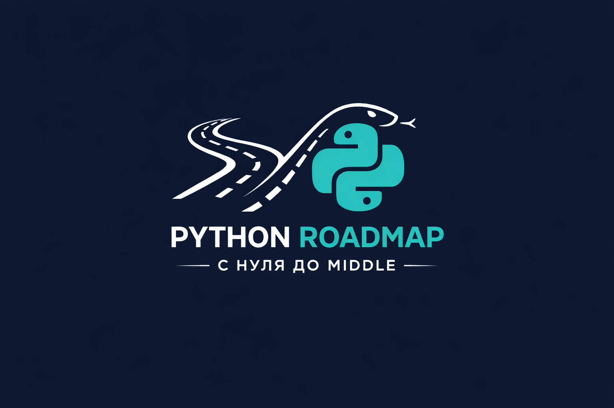

# Мой чек-лист по Python 2026 :purple_heart:

  

📘 Проходите roadmap ещё удобнее — в виде бесплатного курса на Stepik!
Теперь вы можете изучать этот чек-лист в интерактивном формате с возможностью:

- проходить мини-тесты после каждого блока,
- отслеживать свой прогресс,
- получать чёткие рекомендации по обучению.

👉 Курс на Stepik: [Python ROADMAP | С Нуля до Middle 2026](https://stepik.org/course/272237/syllabus)

## Содержание

- Вступление
	1. [С чего стоит начать](#с-чего-стоит-начать)
	2. [Рекомендации к обучению](#рекомендации-к-обучению)

- С нуля до Junior
	1. [Базовый уровень](#базовый-уровень)
	2. [Средний уровень](#средний-уровень)
	3. [EXTRA (Средний уровень)](#extra-средний-уровень-intern)
	4. [Продвинутый уровень](#продвинутый-уровень)
	5. [EXTRA (Продвинутый уровень)](#extra-продвинутый-уровень-intern)
	6. [Профессиональный уровень](#профессиональный-уровень)
	7. [EXTRA (Профессиональный уровень)](#extra-профессиональный-уровень-intern)

- С Junior до Middle
	1. [Базовый уровень](#базовый-уровень-1)
	2. [EXTRA (Базовый уровень)](#extra-базовый-уровень-junior)

- Дополнительный материал
	1. [Книги](#книги)
	2. [Полезные репозитории](#полезные-репозитории)

- [Заключение](#пока-на-этом-всё)
---
### **С чего стоит начать**
В начале пути нужно сразу отсеять ненужную информацию, которая будет вам встречаться на просторах интернета...

А нужную поглощать как и где только возможно. Будь то:
>Ютуб

>Платформы с образовательными курсами

>Документация

>Сайты типа вопрос/ответ (habr, stackoverflow)

и т.д

Хочу сказать, что в самом начале нужно гнаться **только** за знаниями базы Python и далеко от этого не отходить, чтобы в голове не создавалась каша(особенно если вы стартуете с **полного нуля**)
___
### Рекомендации к обучению

1. Если вы учитесь и/или работаете, то
я рекомендую заниматься 3-4 часа в будние дни и 5-8 часов в выходные <u>**every day**</u>, чтобы не терять настрой и не забывать пройденный материал

2. **Не бояться повторять одну и ту же тему**, если она встречается в разных иточниках(повторение - мать учения)

3. **Вести конспекты** - это очень важно, особенно на начальном этапе, потому что это помогает усвоению материала, и не стоит забивать на это

4. **Учиться гуглить** то, что вам не понятно или то, что вы не знаете.
Это очень важный навык в программировании, гуглить вы будете всё и вся, даже (**особенно**) когда дорастёте до продвинутого уровня

5. **Не бояться математики.** Её асппекты будут вам всегда встречаться во время обучения, но под 99% задач уже придумано решение, стоит его только найти или загуглить и запомнить
6. **Практиковаться** всегда, везде и во всём

___

 

# Чек-лист
## С нуля до Junior
### Базовый уровень
1. ["Поколение Python": курс для начинающих](https://stepik.org/course/58852/info)
\
Этот курс наполнен самой базовой базой, здесь и:
    > Основные типы данных

    >Ввод-вывод данных

    >Условный оператор

    >Циклы for и while

    >Функции

И т.д
Так же здесь есть экзаменационные работы, которые покажут ваш уровень знаний по данной теме и море, **МОРЕ** практики

Когда вы узучите базу, переходим на **следущий уровень:**

2. ["Поколение Python": курс для продвинутых](https://stepik.org/course/68343/info)
\
Этот курс наполнен самой базовой базой, здесь и:
    > Ещё больше иипов данных

    >Интересные модули random, decimal, complex и.д

    >Всемии любимый модуль turtle

    >И ещё функции

Так же тут снова много практики для усвоения нового и закрепления старого материала. \
Тоже есть экзаменационные работы

3. ["Поколение Python": курс для профессионалов](https://stepik.org/course/82541/info)

    >Работа с датой и временем

    >Работа с файлами

    >Дополнительные типы коллекций

    >Обработка исключений

    >Рекурсия

    >Итераторы и генераторы

    >Регулярные выражения

и многое другое \
Название обманчиво - вы ещё долгое время не сможете называть себя профессионалом, **всё ещё впереди**

___

### Средний уровень
Во время этого уровня, помимо основных - нумерованных пунктов рекомендую изучить материалы из пунка **'EXTRA'**, который будет указан в конце уровня

4. ["Поколение Python": ООП](https://stepik.org/course/98974/info)
\
Это очень важный курс, который вам поможет изучить принципы ООП, которые вы будете использовать **всегда** в дальнейшем обучении и создании своих проектов

    >Атрибуты, свойства и методы

    >Магические методы

    >Протоколы

И многое другое \
\
*Не забывайте обращаться к документации и поглощать **полезный** контент на ютубе

5. [Интерактивный тренажер по SQL](https://stepik.org/course/63054/info)
\
Вы изучите синтаксис SQL баз данных и узнаете, зачем они нужны \
Это знание будет одним из основополагающих, когда вы преступите к изучению фреймворка Django

    >Основы реляционной модели и SQL

    >Запросы SQL к связанным таблицам

6. [Leetcode](https://leetcode.com)
\
Примерно на этом моменте вы можете приступать к решению задач на этом ресурсе. \
Не забывайте - **нужно много практики**, чтобы по-настоящему овладеть языком и его возможностями

    >Практические задачи

    >Вопросы с интервью

    >Возможность посмотреть решения других юзеров

7. [Web-технологии: начальный уровень](https://stepik.org/course/82108/info)
\
Основы HTML, CSS и JavaScript
Чтобы вы не терялись при базовой вёрстке ваших сайтов для портфолио

    >HTML

    >CSS

    >JavaScript

    >Практика

#### EXTRA (средний уровень intern):
>[Python: Паттерны проектирования](https://stepik.org/course/143519/info)

>[Инди-курс программирования на Python](https://stepik.org/course/63085/info) (повторение)

>[Инди-курс по HTML и CSS](https://stepik.org/course/120494/info)

>[Программирование на Python](https://stepik.org/course/67/info) (повторение)

>[Вселенная тестирования, или Как стать тестировщиком](https://stepik.org/course/118842/info) (интересный курс о тестировании, рекомендую хотя-бы прочитать)

>[Регулярные выражения в Python](https://stepik.org/course/107335/promo)

>[Скрытый урок по декораторам на Stepik](https://stepik.org/lesson/63305/step/1)

---

### Продвинутый уровень
На этом этапе будет очень много чтения документации, и самостоятельного поглощения контента на других ресурсах \
**Не бойтесь повторять одно и то же**, потому что Django большой фреймворк и очень много информации, которую нужно **знать** и уметь **применять**

8. [Django, потанцуем?](https://stepik.org/course/114288/info)
    >Основы

    >CURLs и VIews

    >Шаблоны и статические файлы

    >База данных, ORM, Модели

    >Формы

    >Обработка файлов

 

9. [Курс по backend разработке на Python](https://stepik.org/course/138258/info)
    >Повторение базы языка

    >Практические работы с автоматической проверкой

    >Unit тесты

    >Django Rest framework

    >Темы для продвинутого изучения Django \

Так же на  этом курсе вы узнаете о защите проекта и о том, как можно сделать деплой вашего приложения

10. [SPA сайт на Django Rest Framework и NuxtJS](https://stepik.org/course/82067/info)
    >Bootstrap

    >NuxtJS

    >Повторение

Вместо задач и тестов по теме, вы будете решать рандомные задачи с leetcode, что тоже приятно

11. [Django 5 для начинающих](https://stepik.org/course/174634/info) \
    По-моему мнению лучший курс по Django, который нужно проходить, когда уже сложилось представление что вообще это такое и для чего оно нужно

    > Введение в веб-разработку

    >Создание блога

    >Создание API с помощью Django REST Framework

Много тестов и повторения материала
___
#### EXTRA (продвинутый уровень intern):
>[Структуры данных: selfedu](https://www.youtube.com/watch?v=gHLDdM59Di8&list=PLA0M1Bcd0w8x4jEp1r_aN3xlnlbfx9RQ2)

>[Binary Search | LeetCode](https://www.youtube.com/watch?v=qwgjFDbInao&list=PLYnH8mpFQ4akciTfqmad4Mtam7vG5mWhv&index=1&pp=iAQB)
Плейлист по решению задач на бинарный поиск на LeetCode

>[Docker - Полный курс Docker Для Начинающих](https://www.youtube.com/watch?v=_uZQtRyF6Eg)

>[Я бы рассказал это о django себе в самом начале | Upper Junior](https://www.youtube.com/watch?v=ZHVX0CaO4Tg&t=3s)

>[Статья о Data - Classes](https://habr.com/ru/articles/415829/)

>[Правильные аннотации *args и **kwargs в Python](https://www.youtube.com/watch?v=q1PkSWL9rGk)

---

### Профессиональный уровень
12. [Solvit. тренажёр для подготовки к собеседованиям](https://solvit.space) \
Необходимо как можно чаще проходить задания тут, чтобы быстро набить теоритическую базу.
Отличный тренажёр для того, чтобы вспомнить или изучить новый материал, необходимый для трудоустройста на позицию Backend Python - разработчика.

    >База вопросов

    >Тренажёр

    >Роадмапы

    >Вопросы рекрутёров

 

13. [Добрый, добрый Django с Сергеем Балакиревым](https://stepik.org/course/183363/info) \
Кто-то бы включил этот курс в начало предыдущего уровня, но лично мне этот курс зашёл только когда у него появился экземпляр на Stepik, из-за большого количества практики

    >Шаблоны

    >Связи между таблицами

    >Работа с админ-панелью

    >Классы представлений

    >Авторизация и регистрация

    >PostgreSQL и другие улучшения

Ещё один видео-курс, который наполнен практикой по темам.
Однозначно обязателен к прохождению

14. [Docker для начинающих + практический опыт](https://stepik.org/course/123300/info) \
Узнаете что такое Docker и научитесь с ним работать.\
Курс представлен в формате видео

    >Команды Docker

    >Образы Docker

    >Docker Compose

    >Оркестрация контейнеров

 

15. [Продвинутый Django 5 для продолжающих](https://stepik.org/course/177355/info) \
Ещё один курс по Django, в котором хоть и **мало** практики, но зато очень ценная информация, которую вы бы обирали по крупицам в интернете \
В защиту авторов хочу сказать, что они будут дорабатывать курс и дальше, а так же планируют добавить разного рода задачи, которые помогут закрепить материал.

    >Индексы баз данных

    >Разработка через тестирование

    >Разрешения в Django

    >HTMX на основе CRUD проекта

    >Создание чата на Django с использованием Сhannels и WebSocket

    >Асинхронные задачи в Django + Сelery + Redis

 

16. [Введение в Linux](https://stepik.org/course/73/promo) \
Познакомитесь с Linux, узнаете плюсы и минусы использования на собственном примере.

    >Установка Linux на виртуальную машину

    >Работа на сервере

    >Скрипты на bash: основы

    >Продвинутые темы

17. [Асинхронный Python](https://stepik.org/course/170777/promo) \
Узнаете, что такое асинхронное программирование и научитесь его применять

    >Основы работы с Asyncio

    >Работа с задачами

    >aiofiles

    >aiohttp

 

18. [WEB Парсинг на Python](https://stepik.org/course/104774/promo) \
Научитесь парсить сайты, познакомитесь с сопутствующими библиотеками

    >Библиотека Requests

    >Библиотека BeautifulSoup

    >Фреймворк Selenium

    >Парсинг Telegram

    >Обход капчи

 

19. [Быстрый старт в FastAPI Python](https://stepik.org/course/179694/promo) \
Ознакомитесь с быстрым,модным, современным фреймворком FastAPI

    >Обработка запросов и их проверка

    >Аутентификация и авторизация

    >Интеграция баз данных

    >Тестирование приложений FastAPI

    >Расширенные функции и развертывание

Курс, который даст новые навыки взаимодействия с API, и по новому взглянуть на веб-разработку

20. [FastAPI для начинающих](https://stepik.org/course/180000/info)
\
Самый структурированный курс для освоения FastAPI:
    > накомство с FastAPI

    > Внедрения зависимостей

    > Интернет магазин на FastAPI

    > Продвинутые возможности в FastAPI

    > Деплой проекта через Docker

 Базовая база с самой лучшей проработкой по FastAPI.

21. [FastAPI YouTube курс](https://www.youtube.com/watch?v=z4pbneT6SLw&list=PLYnH8mpFQ4akzzS1D9IHkMuXacb-bD4Cl&index=2) \
Повторите инфу по FastAPI и углубитесь в пройденные темы, а так же узнаете много лайфхаков и секретов в Python

    >Подключение к БД

    >Операции с SQLAlchemy

    >Связи ForeignKey и ManyToMany

    >Аутентификация

    >JWT

22. [Многопоточный Python](https://stepik.org/course/190100/)
\
Курс направлен на изучение и глубокое понимание многопоточности. Целью является обучение разработчиков созданию высокопроизводительных и эффективных многопоточных приложений, позволяющих максимально использовать ресурсы современных систем, а так же:
    > Работа с пулами потоков

    > Потокобезопасные очереди

    > Управление потоками и синхронизация

    > Безопасность потоков

    > Практическое применение и продвинутые техники

И т.д  
Много тестов и достаточное количество **практических** заданий.

___
#### EXTRA (профессиональный уровень intern):

>[FastAPI Пет-Проект](https://youtube.com/playlist?list=PLeLN0qH0-mCVQKZ8-W1LhxDcVlWtTALCS&si=6HUnwy1gkexDe2IW) Продолжите осваивать FastAPI и изучите новые конструкции, с помощью которых сделаете свой пет-проект на этом фреймворке

>[Binary Tree | LeetCode](https://www.youtube.com/watch?v=TcpQLHBpgls&list=PLYnH8mpFQ4akIqs9LZxBwQYHbclvkXahP)
Плейлист по решению задач на бинарные деревья на LeetCode

>[Типизированный Python](https://www.youtube.com/watch?v=dKxiHlZvULQ) Отличное видео, которое поможет лучше узнать Type Hinting в Python

>[Интернет магазин на Python + Django (часть 1)](https://www.youtube.com/watch?v=km6tGZ3OHvQ) отличный курс, для повторения материала по Django и проект в портфолио

>[Интернет магазин на Python + Django (часть 2)](https://www.youtube.com/watch?v=w-ITLbRfhnA) вторая часть отличного курса

>[Ютуб - Курс по FastAPI](https://youtube.com/playlist?list=PLQC1AzOdryAEoWv38AMufTHaGT8KzqScR&si=zZzfQrC3nU1MmKa7) Поможет потренировать знания в FastAPI

>[Ознакомительная статья про Redis в качестве брокера сообщений](https://timeweb.cloud/tutorials/redis/broker-soobshchenij-redis) - Познакомит с очередями в Redis

___
## С Junior до Middle
### Базовый уровень
С этого стоит начать путь до Middle

23. ["Поколение Python": алгоритмы и структуры данных для начинающих](https://stepik.org/course/100575/)
\
Курс подходит как начинающим, так и продвинутым, которые хотят улучшить свои знания по алгоритмам и структурам данных и прорешать много задач., а так же:
    > Алгоритмическое собеседование в Google

    > Алгоритмическое собеседование в Microsoft

    > Методы оптимизации решения задач

    > Системы счисления

    > Структуры данных

    > Математические алгоритмы

И т.д  
Много тестов и большое количество **практических** заданий.

24. [Многопроцессорный Python](https://stepik.org/course/190099)
\
Цель курса научить - использовать все ядра вашего процессора по максимуму, чтобы ускорять сложные вычисления и прокачивать производительность программ. А ещё вы сможете создавать мощные и масштабируемые приложения, которые легко справляются с большими объёмами данных и реальными нагрузками, а так же:
    > Основы модуля multiprocessing

    > Возврат данных из процесса

    > Примитивы синхронизации

    > Менеджеры

    > Пулы процессов

 

25. ["Поколение Python": базы данных и SQL](https://stepik.org/course/113918)
\
Курс от Тимура Гуева и команды Поколение Python, который рассчитан на всех, кто хочет освоить основы реляционных баз данных и язык структурированных запросов SQL, а так же:
    > Группировка данных

    > Подзапросы

    > Соединение таблиц

    > Пользовательские функции и хранимые процедуры

    > Оконные функции

    > Mock-собеседование в Google / VK

Поможет обрести необходимую теорию и понимание структур языка запросов SQL. Для этого тут есть множество теоретических и практических задач разной сложности.

26. [Видео - курс по Django REST Framework](https://www.youtube.com/playlist?list=PLA0M1Bcd0w8xZA3Kl1fYmOH_MfLpiYMRs)
\
Курс от Сергея Балакирева, в котором рассказаны и показаны базовые вещи касательно DFR, а так же:
    > Классы представлений

    > Сериализаторы и их методы

    > Роутеры

    > Ограничение доступа для пользователей

    > Авторизация и аутентификация

 

27. [Рефакторинг и паттерны проектирования](https://refactoring.guru/ru)
\
Неплохая документация по рефакторингу кода и паттернам проектирования, а так же:
    > Для чего нужен рефакторинг

    > Признаки грязного кода

    > Приемы рефакторинга

    > Паттерны проектирования на примерах

 

28. [Самый полный курс по JavaScript для начинающих программистов](https://stepik.org/course/134850)
\
Чтобы стать хорошим Backend разработчиком - необходимо, как минимум иметь представление о структуре кода на фронтенде, а лучше иметь базу по JavaScript, чтобы коммуникация с командой фронтенда не вводила в ступор:
    > Основы

    > Операторы

    > Типы данных

    > Функции

    > Отладка кода

    > Обработка ошибок

 

29. [Самый полный курс по JavaScript для опытных программистов](https://stepik.org/course/177315)
\
Продолжение предыдущего курса. Этот курс предназначен для тех, кто уже овладел основами JavaScript и хочет глубже погрузиться в продвинутые концепции и техники программирования на этом языке:
    > Объекты в JavaScript

    > Прототипы объектов

    > Объектно-ориентированное программирование

    > Структуры данных

    > Введение в паттерны проектирования

    > Асинхронное программирование

___
#### EXTRA (базовый уровень junior):
>[CI/CD — Простым языком на понятном примере](https://www.youtube.com/watch?v=pFKwmEdwZZQ) Реальный пример запуска CI/CD с использованием GitLab

>[Пишем реальный CI/CD пайплайн | GITLAB CI/CD на практике](https://www.youtube.com/watch?v=prOarIqL5Qs) Реальный пример запуска CI/CD с использованием GitLab 2

>[Как писать хорошую документацию](https://habr.com/ru/companies/plesk/articles/562960/) Краткая статья о теоретической части написания грамотной документации к продукту.

>[Основы RabbitMQ: что это и как это работает!](https://www.youtube.com/watch?v=i-Eh-NCa0Tk) Вводное видео по RabbitMQ - автор канала объясняет просто и наглядно

>[API блога на Django REST Framefork](https://pythonru.com/uroki/django-rest-api/amp) Краткое руководство по созданию API на DRF

___

## Дополнительный материал
### Книги:
**1. Проектирование веб-API (Арно Лоре)** - Благодаря этой книге пользоваться вашими веб-сервисами станет легче, и ваши клиенты – как внутренние, так и внешние – останутся довольны. Издание предназначено для разработчиков, обладающих минимальным опытом в создании и использовании API-интерфейсов.

**2. FastAPI: веб-разработка на Python (Любанович Билл)** - Билл Любанович рассказывает о тонкостях разработки с применением FastAPI и предлагает
множество рекомендаций по таким темам, как формы, доступ к базам данных, графика, карты
и многое другое, что поможет освоить основы и даже пойти дальше. Кроме того, вы познакомитесь
с RESTful API, приемами валидации данных, авторизации и повышения производительности.

___
### Полезные репозитории:
1. [Вопросы для подготовки к Python Developer интервью](https://github.com/yakimka/python_interview_questions?tab=readme-ov-file)
2. [Full Stack FastAPI Template](https://github.com/fastapi/full-stack-fastapi-template)
3. [FastAPI Best Practices](https://github.com/zhanymkanov/fastapi-best-practices)
___
### Пока на этом всё

#### По мере изучения чего-то нового я постоянно буду наполнять эту страницу новыми ссылками на ресурсы

##### Это всего лишь моё видение и мой путь в Backend - разработке, вы можете быть не согласный с позицией ресурсов и с описанием к источникам. Буду рад услышать ваше мнение и пожелания для этого чек-листа :relieved:
