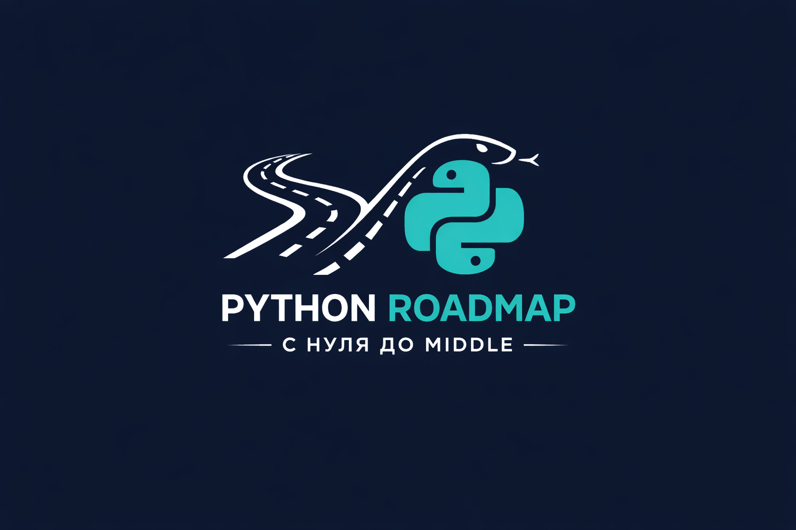

# Мой чек-лист по Python 2026 :purple_heart:

  

📘 Проходите roadmap ещё удобнее — в виде бесплатного курса на Stepik!
Теперь вы можете изучать этот чек-лист в интерактивном формате с возможностью:

- проходить мини-тесты после каждого блока,
- отслеживать свой прогресс,
- получать чёткие рекомендации по обучению.

👉 Курс на Stepik: [Python ROADMAP | С Нуля до Middle 2026](https://stepik.org/course/272237/syllabus)

## Содержание

- Вступление
	1. [С чего стоит начать](#с-чего-стоит-начать)
	2. [Рекомендации к обучению](#рекомендации-к-обучению)

- С нуля до Junior
	1. [Базовый уровень](#базовый-уровень)
	2. [Средний уровень](#средний-уровень)
	3. [EXTRA (Средний уровень)](#extra-средний-уровень-intern)
	4. [Продвинутый уровень](#продвинутый-уровень)
	5. [EXTRA (Продвинутый уровень)](#extra-продвинутый-уровень-intern)
	6. [Профессиональный уровень](#профессиональный-уровень)
	7. [EXTRA (Профессиональный уровень)](#extra-профессиональный-уровень-intern)

- С Junior до Middle
	1. [Базовый уровень](#базовый-уровень-1)
	2. [EXTRA (Базовый уровень)](#extra-базовый-уровень-junior)

- Дополнительный материал
	1. [Книги](#книги)
	2. [Полезные репозитории](#полезные-репозитории)

- [Заключение](#пока-на-этом-всё)
---
### **С чего стоит начать**
В начале пути нужно сразу отсеять ненужную информацию, которая будет вам встречаться на просторах интернета...

А нужную поглощать как и где только возможно. Будь то:
>Ютуб

>Платформы с образовательными курсами

>Документация

>Сайты типа вопрос/ответ (habr, stackoverflow)

и т.д

Хочу сказать, что в самом начале нужно гнаться **только** за знаниями базы Python и далеко от этого не отходить, чтобы в голове не создавалась каша(особенно если вы стартуете с **полного нуля**)
___
### Рекомендации к обучению

1. Если вы учитесь и/или работаете, то
я рекомендую заниматься 3-4 часа в будние дни и 5-8 часов в выходные <u>**every day**</u>, чтобы не терять настрой и не забывать пройденный материал

2. **Не бояться повторять одну и ту же тему**, если она встречается в разных источниках(повторение - мать учения)

3. **Вести конспекты** - это очень важно, особенно на начальном этапе, потому что это помогает усвоению материала, и не стоит забивать на это

4. **Учиться гуглить** то, что вам не понятно или то, что вы не знаете.
Это очень важный навык в программировании, гуглить вы будете всё и вся, даже (**особенно**) когда дорастёте до продвинутого уровня

5. **Не бояться математики.** Её аспекты будут вам всегда встречаться во время обучения, но под 99% задач уже придумано решение, стоит его только найти или загуглить и запомнить
6. **Практиковаться** всегда, везде и во всём

___

 

# Чек-лист
## С нуля до Junior
### Базовый уровень

На этом этапе ваша единственная задача &mdash; освоить основы Python без лишнего. Только база, только практика. Вам не нужно знать Django, FastAPI, SQL &mdash; сначала нужен чистый, крепкий фундамент.

<h4>Что нужно изучить на этом этапе</h4>

<ul>
	<li><strong>Основные типы данных</strong>: int, float, str, list &mdash; строительные блоки программы</li>
	<li><strong>Ввод и вывод данных</strong>: получение данных от пользователя и передача результата</li>
	<li><strong>Условный оператор</strong>: if/elif/else управляет логикой программы</li>
	<li><strong>Циклы</strong>: for и while повторяют действия (перебор списка, ожидание события)</li>
	<li><strong>Функции</strong>: определение, передача аргументов, возврат значений</li>
	<li><strong>Расширенные типы данных</strong>: более сложные конструкции после базового курса</li>
	<li><strong>Полезные модули</strong>: random, decimal, complex &mdash; работа с числами</li>
	<li><strong>Продвинутые функции</strong>: мощные и гибкие функции после освоения базы</li>
	<li><strong>Работа с датой и временем</strong>: управление временем</li>
	<li><strong>Работа с файлами</strong>: чтение и запись файлов</li>
	<li><strong>Дополнительные коллекции</strong>: set, frozenset, namedtuple</li>
	<li><strong>Обработка исключений</strong>: try/except/finally предотвращает крах</li>
	<li><strong>Рекурсия</strong>: функции могут вызывать себя</li>
	<li><strong>Итераторы и генераторы</strong>: потоки данных без лишних списков</li>
	<li><strong>Регулярные выражения (базово)</strong>: поиск и замена текста</li>
</ul>

<h4>Ресурсы для изучения</h4>

1. ["Поколение Python": курс для начинающих](https://stepik.org/course/58852/info)
\
Этот курс наполнен самой базовой базой, здесь и:
    > Основные типы данных

    >Ввод-вывод данных

    >Условный оператор

    >Циклы for и while

    >Функции

И т.д
Так же здесь есть экзаменационные работы, которые покажут ваш уровень знаний по данной теме и море, **МОРЕ** практики

Когда вы узучите базу, переходим на **следущий уровень:**

2. ["Поколение Python": курс для продвинутых](https://stepik.org/course/68343/info)
\
Этот курс наполнен самой базовой базой, здесь и:
    > Ещё больше типов данных

    >Интересные модули random, decimal, complex и.д

    >Всеми любимый модуль turtle

    >И ещё функции

Так же тут снова много практики для усвоения нового и закрепления старого материала. \
Тоже есть экзаменационные работы

3. ["Поколение Python": курс для профессионалов](https://stepik.org/course/82541/info)

    >Работа с датой и временем

    >Работа с файлами

    >Дополнительные типы коллекций

    >Обработка исключений

    >Рекурсия

    >Итераторы и генераторы

    >Регулярные выражения

и многое другое \
Название обманчиво - вы ещё долгое время не сможете называть себя профессионалом, **всё ещё впереди** \
❗❗❗ БЕСПЛАТНАЯ АЛЬТЕРНАТИВА [Добрый, добрый Python с Сергеем Балакиревым](https://stepik.org/course/100707/promo)

___

### Средний уровень
Во время этого уровня, помимо основных - нумерованных пунктов рекомендую изучить материалы из пункта **'EXTRA'**, который будет указан в конце уровня

Вы прошли базу — поздравляем! Теперь пора переходить к темам, без которых невозможно стать бэкенд-разработчиком: ООП, SQL, веб-основы и алгоритмы.

<h4>Что нужно изучить на этом этапе</h4>

<ul>
	<li><strong>ООП (Объектно-ориентированное программирование)</strong>: атрибуты, свойства, методы, магические методы (__init__, __str__), наследование, композиция, инкапсуляция</li>
	<li><strong>Протоколы и интерфейсы</strong>: как Python организации классы и объекты для построения архитектуры</li>
	<li><strong>SQL (базы данных)</strong>: реляционная модель, запросы SELECT, WHERE, JOIN, GROUP BY, работа с связанными таблицами</li>
	<li><strong>Алгоритмы и структуры данных</strong>: логика решения задач, readiness для собеседований (LeetCode Easy)</li>
	<li><strong>Web-технологии (базово)</strong>: HTML, CSS, JavaScript — основы фронтенда для портфолио-проектов</li>
	<li><strong>Практика сборки страниц</strong>: создание простых админок и форм без фреймворков</li>
</ul>

<h4>Ресурсы для изучения</h4>

4. ["Поколение Python": ООП](https://stepik.org/course/98974/info)
\
Это очень важный курс, который вам поможет изучить принципы ООП, которые вы будете использовать **всегда** в дальнейшем обучении и создании своих проектов

    >Атрибуты, свойства и методы

    >Магические методы

    >Протоколы

И многое другое \
\
*Не забывайте обращаться к документации и поглощать **полезный** контент на ютубе

5. [Интерактивный тренажер по SQL](https://stepik.org/course/63054/info)
\
Вы изучите синтаксис SQL баз данных и узнаете, зачем они нужны \
Это знание будет одним из основополагающих, когда вы преступите к изучению фреймворка Django

    >Основы реляционной модели и SQL

    >Запросы SQL к связанным таблицам

6. [Leetcode](https://leetcode.com)
\
Примерно на этом моменте вы можете приступать к решению задач на этом ресурсе. \
Не забывайте - **нужно много практики**, чтобы по-настоящему овладеть языком и его возможностями

    >Практические задачи

    >Вопросы с интервью

    >Возможность посмотреть решения других юзеров

7. [Web-технологии: начальный уровень](https://stepik.org/course/82108/info)
\
Основы HTML, CSS и JavaScript
Чтобы вы не терялись при базовой вёрстке ваших сайтов для портфолио

    >HTML

    >CSS

    >JavaScript

    >Практика

#### EXTRA (средний уровень intern):

Этот раздел — не опциональный бонус, а усиление и повторение пройденного. Здесь вы найдёте материалы, которые помогут закрепить основы, увидеть темы с другой стороны и расширить кругозор без отрыва от практики.

<blockquote>

💡 Даже если чувствуете, что «всё поняли» — пройдите хотя бы часть. Повторение ускоряет автоматизм.

</blockquote>

<h4>Что нужно изучить на этом этапе</h4>

<ul>
	<li><strong>Фундамент компьютерных наук</strong>: алгоритмы, абстракция, вычислительное мышление</li>
	<li><strong>Паттерны проектирования</strong>: Singleton, Factory, Observer и когда их использовать</li>
	<li><strong>Повторение базы</strong>: новый взгляд на знакомые темы</li>
	<li><strong>Углублённая вёрстка</strong>: HTML, CSS для pet-проектов</li>
	<li><strong>Тестирование (базово)</strong>: как работают тесты</li>
	<li><strong>Регулярные выражения</strong>: re для парсинга, валидации и обработки текста</li>
	<li><strong>Декораторы</strong>: одна из самых элегантных фич Python</li>
</ul>

<h4>Ресурсы для изучения</h4>

>[CS50x Lectures (видео-курс на английском)](https://www.youtube.com/playlist?list=PLhQjrBD2T383q7Vn8QnTsVgSvyLpsqL_R)

>[Python: Паттерны проектирования](https://stepik.org/course/143519/info)

>[Инди-курс программирования на Python](https://stepik.org/course/63085/info) (повторение)

>[Инди-курс по HTML и CSS](https://stepik.org/course/120494/info)

>[Программирование на Python](https://stepik.org/course/67/info) (повторение)

>[Вселенная тестирования, или Как стать тестировщиком](https://stepik.org/course/118842/info) (интересный курс о тестировании, рекомендую хотя-бы прочитать)

>[Регулярные выражения в Python](https://stepik.org/course/107335/promo)

>[Скрытый урок по декораторам на Stepik](https://stepik.org/lesson/63305/step/1)

---

### Продвинутый уровень

Поздравляем — вы подошли к этапу, где начинается реальная веб-разработка. Здесь вас ждёт Django — мощный фреймворк, на котором строят тысячи production-проектов.

<blockquote>

💡 На этом этапе будет очень много чтения документации и самостоятельного изучения материалов. Это нормально. Django большой, и чтобы уверенно в нём работать, нужно не просто пройти курс, а понять логику.

</blockquote>

<blockquote>

🔄 Не бойтесь повторять одно и то же. Одна и та же тема (например, ORM или формы) может встречаться в разных курсах — это помогает глубже усвоить материал, а не мешает.

</blockquote>

<h4>Что нужно изучить на этом этапе</h4>

<ul>
	<li><strong>Архитектура Django (MTV)</strong>: Model-Template-View — основа фреймворка</li>
	<li><strong>URL-маршруты и Views</strong>: как обрабатывать запросы и возвращать ответы</li>
	<li><strong>Шаблоны и статические файлы</strong>: HTML, CSS, JavaScript в контексте Django</li>
	<li><strong>Работа с базой данных через ORM</strong>: модели, миграции, запросы без SQL</li>
	<li><strong>Формы и обработка файлов</strong>: валидация, сохранение, загрузка</li>
	<li><strong>Unit-тесты</strong>: как писать тесты для своего кода</li>
	<li><strong>Django REST Framework (DRF)</strong>: создание REST API с авторизацией и валидацией</li>
	<li><strong>Безопасность и деплой</strong>: защита проекта, публикация в продакшен</li>
	<li><strong>Full-stack приложение</strong>: интеграция backend (DRF) и frontend (NuxtJS/Vue.js)</li>
</ul>

<h4>Ресурсы для изучения</h4>

8. [Django, потанцуем?](https://stepik.org/course/114288/info)
    >Основы

    >CURLs и VIews

    >Шаблоны и статические файлы

    >База данных, ORM, Модели

    >Формы

    >Обработка файлов

 

9. [Курс по backend разработке на Python](https://stepik.org/course/138258/info)
    >Повторение базы языка

    >Практические работы с автоматической проверкой

    >Unit тесты

    >Django Rest framework

    >Темы для продвинутого изучения Django \

Так же на  этом курсе вы узнаете о защите проекта и о том, как можно сделать деплой вашего приложения

10. [SPA сайт на Django Rest Framework и NuxtJS](https://stepik.org/course/82067/info)
    >Bootstrap

    >NuxtJS

    >Повторение

Вместо задач и тестов по теме, вы будете решать рандомные задачи с leetcode, что тоже приятно

11. [Django 5 для начинающих](https://stepik.org/course/174634/info) \
    По-моему мнению лучший курс по Django, который нужно проходить, когда уже сложилось представление что вообще это такое и для чего оно нужно

    > Введение в веб-разработку

    >Создание блога

    >Создание API с помощью Django REST Framework

Много тестов и повторения материала
___
#### EXTRA (продвинутый уровень intern):

Этот раздел — не просто «дополнительно», а усиление ключевых навыков, которые вы начали осваивать на уровне «Продвинутый». Здесь вас ждёт углубление в структуры данных, инструменты разработки, тонкости Python и советы от опытных разработчиков.

<blockquote>

💡 Даже если вы чувствуете уверенность — <strong>пройдите хотя бы часть материалов</strong>. Они помогут вам писать <strong>чище, быстрее и профессиональнее</strong>.

</blockquote>

<h4>Что нужно изучить на этом этапе</h4>

<ul>
	<li><strong>Структуры данных</strong>: списки, словари, множества, деревья, графы — осознанное выбор в реальных задачах</li>
	<li><strong>Бинарный поиск</strong>: частая тема на собеседованиях, ключ к эффективным решениям на LeetCode</li>
	<li><strong>Docker</strong>: контейнеризация — must-have для любого бэкендера</li>
	<li><strong>Практики Django в продакшене</strong>: паттерны, на которых теряют время новички</li>
	<li><strong>Data Classes</strong>: @dataclass для современных классов, хранящих данные</li>
	<li><strong>Типизация</strong>: грамотные аннотации *args и **kwargs</li>
</ul>

<h4>Ресурсы для изучения</h4>

>[Структуры данных: selfedu](https://www.youtube.com/watch?v=gHLDdM59Di8&list=PLA0M1Bcd0w8x4jEp1r_aN3xlnlbfx9RQ2)

>[Binary Search | LeetCode](https://www.youtube.com/watch?v=qwgjFDbInao&list=PLYnH8mpFQ4akciTfqmad4Mtam7vG5mWhv&index=1&pp=iAQB)
Плейлист по решению задач на бинарный поиск на LeetCode

>[Docker - Полный курс Docker Для Начинающих](https://www.youtube.com/watch?v=_uZQtRyF6Eg)

>[Я бы рассказал это о django себе в самом начале | Upper Junior](https://www.youtube.com/watch?v=ZHVX0CaO4Tg&t=3s)

>[Статья о Data - Classes](https://habr.com/ru/articles/415829/)

>[Правильные аннотации *args и **kwargs в Python](https://www.youtube.com/watch?v=q1PkSWL9rGk)

---

### Профессиональный уровень

Вы уже умеете писать код — теперь пора научиться <strong>работать как инженер</strong>. 
На этом этапе вы углубитесь в production-темы: контейнеризация, асинхронность, тестирование, безопасность, DevOps-минимум и современные фреймворки.

<blockquote>

💡 Это не «профессионализм» в смысле Senior, а <strong>готовность к работе на позиции Junior Backend Python Developer</strong>. 
Всё, что здесь собрано — реально используется в проектах ежедневно.

</blockquote>

<h4>Что нужно изучить на этом этапе</h4>

<ul>
	<li><strong>Git</strong>: ветвление, remote-репозитории, push/pull, продвинутые remotes</li>
	<li><strong>Подготовка к собеседованиям</strong>: вопросы по Python, Django, SQL, Docker; интерактивные тренажёры</li>
	<li><strong>Django в продакшене</strong>: шаблоны, админка, ForeignKey/ManyToMany, Class-Based Views, авторизация, PostgreSQL</li>
	<li><strong>Docker</strong>: образы, контейнеры, docker-compose.yml, оркестрация многокомпонентных систем</li>
	<li><strong>Продвинутый Django</strong>: индексы БД, TDD, Permissions, HTMX, Django Channels + WebSocket, Celery + Redis</li>
	<li><strong>Linux (DevOps-минимум)</strong>: терминал, bash-скрипты, подключение к удалённым серверам</li>
	<li><strong>Асинхронный Python</strong>: async/await, asyncio, aiohttp, aiofiles, нелинейное мышление</li>
	<li><strong>WEB Парсинг</strong>: requests + BeautifulSoup, Selenium, парсинг Telegram, обход капчи</li>
	<li><strong>FastAPI (два курса)</strong>: Pydantic, аутентификация, интеграция с БД, тестирование, деплой, Dependency Injection, SQLAlchemy, JWT</li>
	<li><strong>Многопоточность</strong>: пулы потоков, потокобезопасные очереди, синхронизация, блокировки, race conditions, deadlocks</li>
</ul>

<h4>Ресурсы для изучения</h4>

12. [Learn Git Branching. тренажёр для изучения Git](https://learngitbranching.js.org/?locale=ru_RU) \
Отличный тренажёр для того, чтобы вспомнить или изучить новый материал. Есть 2 вида уровней: Основы и Удалённые репозитории.

    >Хорошо подобранное введение в основные команды git

    >Ассорти из приёмов работы с Git, хитростей и советов

    >Push & Pull - удалённые репозитории в Git

    >Продвинутое использование Git Remotes

 

13.  [Solvit. тренажёр для подготовки к собеседованиям](https://solvit.space) \
Необходимо как можно чаще проходить задания тут, чтобы быстро набить теоретическую базу.
Отличный тренажёр для того, чтобы вспомнить или изучить новый материал, необходимый для трудоустройста на позицию Backend Python - разработчика.

    >База вопросов

    >Тренажёр

    >Роадмапы

    >Вопросы рекрутёров

 

14. [Добрый, добрый Django с Сергеем Балакиревым](https://stepik.org/course/183363/info) \
Кто-то бы включил этот курс в начало предыдущего уровня, но лично мне этот курс зашёл только когда у него появился экземпляр на Stepik, из-за большого количества практики

    >Шаблоны

    >Связи между таблицами

    >Работа с админ-панелью

    >Классы представлений

    >Авторизация и регистрация

    >PostgreSQL и другие улучшения

Ещё один видео-курс, который наполнен практикой по темам.
Однозначно обязателен к прохождению

15. [Docker для начинающих + практический опыт](https://stepik.org/course/123300/info) \
Узнаете что такое Docker и научитесь с ним работать.\
Курс представлен в формате видео

    >Команды Docker

    >Образы Docker

    >Docker Compose

    >Оркестрация контейнеров

 

16. [Продвинутый Django 5 для продолжающих](https://stepik.org/course/177355/info) \
Ещё один курс по Django, в котором хоть и **мало** практики, но зато очень ценная информация, которую вы бы собирали по крупицам в интернете \
В защиту авторов хочу сказать, что они будут дорабатывать курс и дальше, а так же планируют добавить разного рода задачи, которые помогут закрепить материал.

    >Индексы баз данных

    >Разработка через тестирование

    >Разрешения в Django

    >HTMX на основе CRUD проекта

    >Создание чата на Django с использованием Сhannels и WebSocket

    >Асинхронные задачи в Django + Сelery + Redis

 

17. [Введение в Linux](https://stepik.org/course/73/promo) \
Познакомитесь с Linux, узнаете плюсы и минусы использования на собственном примере.

    >Установка Linux на виртуальную машину

    >Работа на сервере

    >Скрипты на bash: основы

    >Продвинутые темы

18. [Асинхронный Python](https://stepik.org/course/170777/promo) \
Узнаете, что такое асинхронное программирование и научитесь его применять

    >Основы работы с Asyncio

    >Работа с задачами

    >aiofiles

    >aiohttp

 

19. [WEB Парсинг на Python](https://stepik.org/course/104774/promo) \
Научитесь парсить сайты, познакомитесь с сопутствующими библиотеками

    >Библиотека Requests

    >Библиотека BeautifulSoup

    >Фреймворк Selenium

    >Парсинг Telegram

    >Обход капчи

 

20. [Быстрый старт в FastAPI Python](https://stepik.org/course/179694/promo) \
Ознакомитесь с быстрым,модным, современным фреймворком FastAPI

    >Обработка запросов и их проверка

    >Аутентификация и авторизация

    >Интеграция баз данных

    >Тестирование приложений FastAPI

    >Расширенные функции и развертывание

Курс, который даст новые навыки взаимодействия с API, и по новому взглянуть на веб-разработку

21. [FastAPI для начинающих](https://stepik.org/course/180000/info)
\
Самый структурированный курс для освоения FastAPI:
    > накомство с FastAPI

    > Внедрения зависимостей

    > Интернет магазин на FastAPI

    > Продвинутые возможности в FastAPI

    > Деплой проекта через Docker

 Базовая база с самой лучшей проработкой по FastAPI.

22. [FastAPI YouTube курс](https://www.youtube.com/watch?v=z4pbneT6SLw&list=PLYnH8mpFQ4akzzS1D9IHkMuXacb-bD4Cl&index=2) \
Повторите инфу по FastAPI и углубитесь в пройденные темы, а так же узнаете много лайфхаков и секретов в Python

    >Подключение к БД

    >Операции с SQLAlchemy

    >Связи ForeignKey и ManyToMany

    >Аутентификация

    >JWT

23. [Многопоточный Python](https://stepik.org/course/190100/)
\
Курс направлен на изучение и глубокое понимание многопоточности. Целью является обучение разработчиков созданию высокопроизводительных и эффективных многопоточных приложений, позволяющих максимально использовать ресурсы современных систем, а так же:
    > Работа с пулами потоков

    > Потокобезопасные очереди

    > Управление потоками и синхронизация

    > Безопасность потоков

    > Практическое применение и продвинутые техники

И т.д  
Много тестов и достаточное количество **практических** заданий.

___
#### EXTRA (профессиональный уровень intern):

Этот раздел завершает путь от новичка до Junior-разработчика. 
Здесь вас ждёт <strong>практика через реальные проекты</strong>, углубление в ключевые темы и подготовка к портфолио.

<blockquote>

💡 Даже если вы чувствуете уверенность — <strong>пройдите хотя бы 1–2 пункта полностью</strong>. Это закрепит навыки и даст материал для портфолио на GitHub.

</blockquote>

<h4>Что нужно изучить на этом этапе</h4>

<ul>
	<li><strong>Git</strong>: установка, репозитории, коммиты, ветки, Pull Request, Code Review</li>
	<li><strong>Git-конфликты</strong>: Cherry-pick, Revert, Reset, организация веток, Merge Request</li>
	<li><strong>SQLAlchemy 2.0</strong>: Core и ORM, декларативные модели, сложные запросы, транзакции, связи, N+1, асинхронный SQLAlchemy, миграции через Alembic</li>
	<li><strong>FastAPI Пет-Проект</strong>: валидация через Pydantic, интеграция фронтенда и бэкенда, структура файлов, кэширование Redis, фоновые задачи Celery + Flower</li>
	<li><strong>Бинарные деревья (LeetCode)</strong>: рекурсивная логика, обход (in-order, pre-order, post-order), балансировка, поиск</li>
	<li><strong>Типизированный Python</strong>: typing, Generic, Protocol — читаемость, раннее выявление ошибок, поддержка в IDE</li>
	<li><strong>Интернет-магазин на Django (часть 1)</strong>: модели товаров, категорий, корзины, админка, управление заказами, авторизация, профили</li>
	<li><strong>Интернет-магазин на Django (часть 2)</strong>: оплата (имитация), email-уведомления, оптимизация запросов (select_related, prefetch_related), тестирование</li>
	<li><strong>FastAPI (видео-курс)</strong>: SQLAlchemy, ForeignKey, ManyToMany, JWT-авторизация, архитектурные советы</li>
	<li><strong>Redis как брокер сообщений</strong>: очереди (LPUSH/BRPOP), pub/sub, Streams (Redis ≥5.0), фоновые задачи без Celery</li>
</ul>

<h4>Ресурсы для изучения</h4>

>[Git — Простым Языком на Понятном Примере](https://www.youtube.com/watch?v=cG-8NnH4x94) Артём Шумейко показывает, как пользоваться Git в реальных задачах разработчика — от установки до Code Review. Без воды. Только практика.

>[Git: Конфликты для Начинающих // Git Cherry Pick, Git Revert, Git Reset](https://www.youtube.com/watch?v=F7FnnfnB9YY) Влад Мишустин покажет как делать коммиты, создавать ветки и пушить их на GitHub. Он покажет, что такое ветки и как они организованы. Затем разберет такую полезную функцию как Pull Requests, которая позволяет не уничтожить ваш мастер чьим-то совершенно эпическим косяком в коде, который может вообще приложение обнулить, например.

>[FastAPI Пет-Проект](https://youtube.com/playlist?list=PLeLN0qH0-mCVQKZ8-W1LhxDcVlWtTALCS&si=6HUnwy1gkexDe2IW) Продолжите осваивать FastAPI и изучите новые конструкции, с помощью которых сделаете свой пет-проект на этом фреймворке

>[SQLAlchemy: практическая работа с базой данных в Python](https://stepik.org/course/232655/promo) Этот курс подробное и практическое руководство по работе с SQLAlchemy 2.0 от именитого автора Ильи Перминова. Вы изучите Core и ORM, научитесь проектировать декларативные модели, строить сложные запросы, управлять транзакциями и связями, избегать N+1, работать с асинхронным SQLAlchemy и выполнять миграции через Alembic

>[Binary Tree | LeetCode](https://www.youtube.com/watch?v=TcpQLHBpgls&list=PLYnH8mpFQ4akIqs9LZxBwQYHbclvkXahP)
Плейлист по решению задач на бинарные деревья на LeetCode

>[Типизированный Python](https://www.youtube.com/watch?v=dKxiHlZvULQ) Отличное видео, которое поможет лучше узнать Type Hinting в Python

>[Интернет магазин на Python + Django (часть 1)](https://www.youtube.com/watch?v=km6tGZ3OHvQ) отличный курс, для повторения материала по Django и проект в портфолио

>[Интернет магазин на Python + Django (часть 2)](https://www.youtube.com/watch?v=w-ITLbRfhnA) вторая часть отличного курса

>[Ютуб - Курс по FastAPI](https://youtube.com/playlist?list=PLQC1AzOdryAEoWv38AMufTHaGT8KzqScR&si=zZzfQrC3nU1MmKa7) Поможет потренировать знания в FastAPI

>[Ознакомительная статья про Redis в качестве брокера сообщений](https://timeweb.cloud/tutorials/redis/broker-soobshchenij-redis) - Познакомит с очередями в Redis

___
## С Junior до Middle
### Базовый уровень

Вы уже умеете писать код — теперь пора научиться <strong>писать его правильно, эффективно и масштабируемо</strong>. 
Этот блок закладывает фундамент для работы на уровне <strong>Middle Backend Developer</strong>.

<blockquote>

💡 Здесь вы углубите знания по алгоритмам, SQL, архитектуре, производительности и даже немного фронтенда — чтобы уверенно взаимодействовать с командой.

</blockquote>

<h4>Что нужно изучить на этом этапе</h4>

<ul>
	<li><strong>Алгоритмы и структуры данных</strong>: списки, стеки, очереди, деревья, графы — классические алгоритмы, сортировка, поиск, рекурсия</li>
	<li><strong>Многопроцессорность Python</strong>: модуль multiprocessing, примитивы синхронизации (Lock, Semaphore), пулы процессов — для CPU-bound задач</li>
	<li><strong>SQL (продвинутый)</strong>: GROUP BY, агрегаты, подзапросы, JOIN всех типов, оконные функции, хранимые процедуры — must-have для бэкендера</li>
	<li><strong>Django REST Framework</strong>: классы представлений (APIView, ViewSet), сериализаторы, роутеры, авторизация (Token, Session, JWT), throttling</li>
	<li><strong>Рефакторинг и паттерны</strong>: признаки «грязного» кода, безопасное улучшение, паттерны (Strategy, Factory, Observer) — отличие Junior от Middle</li>
	<li><strong>JavaScript (база)</strong>: синтаксис, типы данных, функции, область видимости — для общения с фронтенд-разработчиками</li>
	<li><strong>JavaScript (продвинутый)</strong>: объекты, прототипы, ООП в JS, асинхронность (Promise, async/await) — для full-stack проектов</li>
</ul>

<h4>Ресурсы для изучения</h4>

24. ["Поколение Python": алгоритмы и структуры данных для начинающих](https://stepik.org/course/100575/)
\
Курс подходит как начинающим, так и продвинутым, которые хотят улучшить свои знания по алгоритмам и структурам данных и прорешать много задач., а так же:
    > Алгоритмическое собеседование в Google

    > Алгоритмическое собеседование в Microsoft

    > Методы оптимизации решения задач

    > Системы счисления

    > Структуры данных

    > Математические алгоритмы

И т.д  
Много тестов и большое количество **практических** заданий.

25. [Многопроцессорный Python](https://stepik.org/course/190099)
\
Цель курса научить - использовать все ядра вашего процессора по максимуму, чтобы ускорять сложные вычисления и прокачивать производительность программ. А ещё вы сможете создавать мощные и масштабируемые приложения, которые легко справляются с большими объёмами данных и реальными нагрузками, а так же:
    > Основы модуля multiprocessing

    > Возврат данных из процесса

    > Примитивы синхронизации

    > Менеджеры

    > Пулы процессов

 

26. ["Поколение Python": базы данных и SQL](https://stepik.org/course/113918)
\
Курс от Тимура Гуева и команды Поколение Python, который рассчитан на всех, кто хочет освоить основы реляционных баз данных и язык структурированных запросов SQL, а так же:
    > Группировка данных

    > Подзапросы

    > Соединение таблиц

    > Пользовательские функции и хранимые процедуры

    > Оконные функции

    > Mock-собеседование в Google / VK

Поможет обрести необходимую теорию и понимание структур языка запросов SQL. Для этого тут есть множество теоретических и практических задач разной сложности.

27. [Видео - курс по Django REST Framework](https://www.youtube.com/playlist?list=PLA0M1Bcd0w8xZA3Kl1fYmOH_MfLpiYMRs)
\
Курс от Сергея Балакирева, в котором рассказаны и показаны базовые вещи касательно DFR, а так же:
    > Классы представлений

    > Сериализаторы и их методы

    > Роутеры

    > Ограничение доступа для пользователей

    > Авторизация и аутентификация

 

28. [Рефакторинг и паттерны проектирования](https://refactoring.guru/ru)
\
Неплохая документация по рефакторингу кода и паттернам проектирования, а так же:
    > Для чего нужен рефакторинг

    > Признаки грязного кода

    > Приемы рефакторинга

    > Паттерны проектирования на примерах

 

29. [Самый полный курс по JavaScript для начинающих программистов](https://stepik.org/course/134850)
\
Чтобы стать хорошим Backend разработчиком - необходимо, как минимум иметь представление о структуре кода на фронтенде, а лучше иметь базу по JavaScript, чтобы коммуникация с командой фронтенда не вводила в ступор:
    > Основы

    > Операторы

    > Типы данных

    > Функции

    > Отладка кода

    > Обработка ошибок

 

30. [Самый полный курс по JavaScript для опытных программистов](https://stepik.org/course/177315)
\
Продолжение предыдущего курса. Этот курс предназначен для тех, кто уже овладел основами JavaScript и хочет глубже погрузиться в продвинутые концепции и техники программирования на этом языке:
    > Объекты в JavaScript

    > Прототипы объектов

    > Объектно-ориентированное программирование

    > Структуры данных

    > Введение в паттерны проектирования

    > Асинхронное программирование

___
#### EXTRA (базовый уровень junior):

Этот раздел дополняет основной блок «С Junior до Middle» практическими навыками, которые часто упускают на этапе обучения, но которые <strong>обязательно спрашивают на собеседованиях</strong> и используют в реальных проектах.

<blockquote>

💡 Даже если вы пока не планируете деплоить сервисы или писать документацию — ознакомьтесь с материалами. Это расширит ваш инженерный кругозор.

</blockquote>

<h4>Что нужно изучить на этом этапе</h4>

<ul>
	<li><strong>CI/CD</strong>: pipeline, автоматизация тестов при пуше, базовая сборка и деплой</li>
	<li><strong>Multi-stage CI/CD</strong>: переменные окружения, Docker, тегирование образов</li>
	<li><strong>Документация</strong>: как писать так, чтобы пользователь быстро находил нужное, инструкции были самодостаточными, текст понятен новичку</li>
	<li><strong>RabbitMQ</strong>: model producer/consumer, очереди, exchange, routing, микросервисы</li>
	<li><strong>DRF-практика</strong>: модели, сериализаторы, ViewSets, маршрутизация, авторизация, защита эндпоинтов</li>
</ul>

<h4>Ресурсы для изучения</h4>

>[CI/CD — Простым языком на понятном примере](https://www.youtube.com/watch?v=pFKwmEdwZZQ) Реальный пример запуска CI/CD с использованием GitLab

>[Пишем реальный CI/CD пайплайн | GITLAB CI/CD на практике](https://www.youtube.com/watch?v=prOarIqL5Qs) Реальный пример запуска CI/CD с использованием GitLab 2

>[Как писать хорошую документацию](https://habr.com/ru/companies/plesk/articles/562960/) Краткая статья о теоретической части написания грамотной документации к продукту.

>[Основы RabbitMQ: что это и как это работает!](https://www.youtube.com/watch?v=i-Eh-NCa0Tk) Вводное видео по RabbitMQ - автор канала объясняет просто и наглядно

>[API блога на Django REST Framefork](https://pythonru.com/uroki/django-rest-api/amp) Краткое руководство по созданию API на DRF

___

## Дополнительный материал
### Книги:
**1. Проектирование веб-API (Арно Лоре)** - Благодаря этой книге пользоваться вашими веб-сервисами станет легче, и ваши клиенты – как внутренние, так и внешние – останутся довольны. Издание предназначено для разработчиков, обладающих минимальным опытом в создании и использовании API-интерфейсов.

**2. FastAPI: веб-разработка на Python (Любанович Билл)** - Билл Любанович рассказывает о тонкостях разработки с применением FastAPI и предлагает
множество рекомендаций по таким темам, как формы, доступ к базам данных, графика, карты
и многое другое, что поможет освоить основы и даже пойти дальше. Кроме того, вы познакомитесь
с RESTful API, приемами валидации данных, авторизации и повышения производительности.

___
### Полезные репозитории:
1. [Вопросы для подготовки к Python Developer интервью](https://github.com/yakimka/python_interview_questions?tab=readme-ov-file)
2. [Full Stack FastAPI Template](https://github.com/fastapi/full-stack-fastapi-template)
3. [FastAPI Best Practices](https://github.com/zhanymkanov/fastapi-best-practices)
___
### Пока на этом всё

#### По мере изучения чего-то нового я постоянно буду наполнять эту страницу новыми ссылками на ресурсы

##### Это всего лишь моё видение и мой путь в Backend - разработке, вы можете быть не согласный с позицией ресурсов и с описанием к источникам. Буду рад услышать ваше мнение и пожелания для этого чек-листа :relieved:
